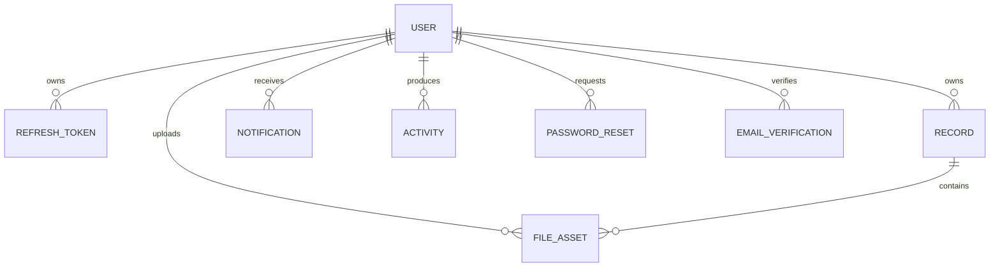

# Entity relationship diagram

All user and record deletions are soft deletes. Refresh sessions, notifications, activities, reset tokens, verification tokens, and file records use database cascades where their parent is permanently removed.
